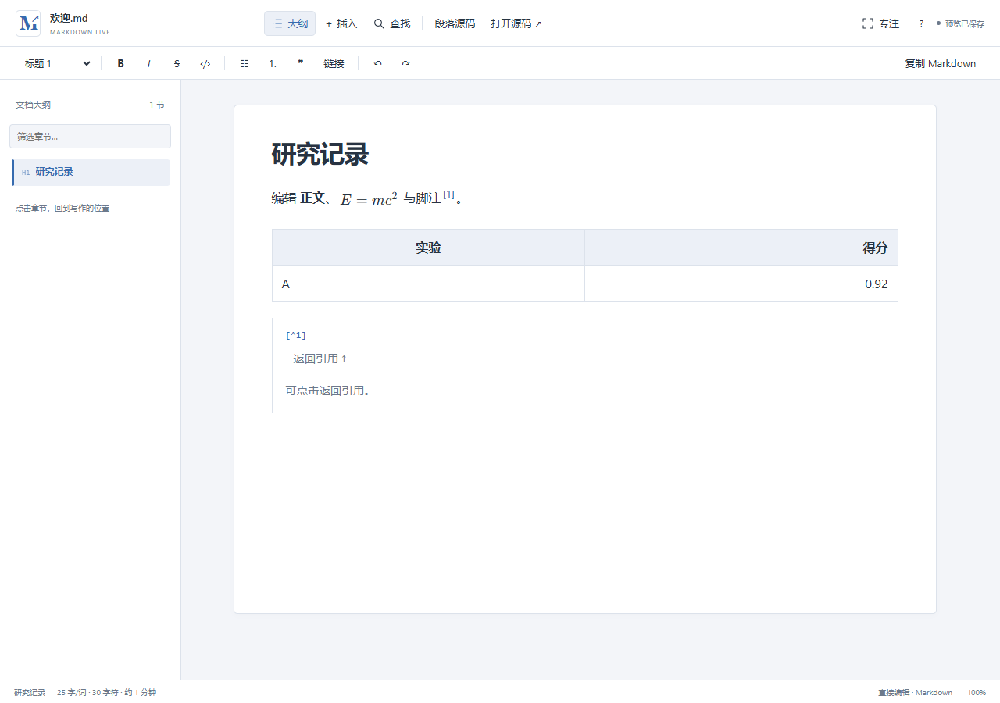

# Markdown Live

在 VS Code 的渲染界面中直接阅读和修改 Markdown，保留普通 `.md` 文件与原生保存、撤销、文件管理工作流。



## 安装和使用

1. 从 [GitHub Releases](https://github.com/zJay26/vscode-markdown-preview/releases/latest) 下载 `markdown-live-0.2.0.vsix`，然后在 VS Code 的扩展菜单中选择 **Install from VSIX…** 安装。
2. 打开 `.md` 或 `.markdown` 文件，点击编辑器标题栏的 **Markdown Live: 打开可视化编辑**，或右键编辑器标签 → **Reopen Editor With… → Markdown Live**。
3. 直接点击正文开始修改。插件不会自动更改已有的默认编辑器关联；可在 Reopen Editor With 菜单中自行设为默认。

Remote WSL：在 WSL 窗口中安装同一 VSIX。插件运行在 workspace 扩展宿主，图片保存在 Markdown 所在的 WSL 文件系统中，不会写入同名 Windows 路径。

Release 同时提供源码压缩包与 `SHA256SUMS.txt` 校验文件。本地构建的安装包输出到 `artifacts/`。

### 常用操作

| 操作 | 方法 |
| --- | --- |
| 排版 | 使用常驻排版工具栏或选中文字后的浮动工具栏；`Ctrl+B` 粗体，`Ctrl+I` 斜体；支持正文与 1–6 级标题 |
| 标题、列表、引用 | 输入 `# `、`- `、`1. `、`> `；也可从顶部“插入”菜单选择 |
| 插入内容 | 空段落输入 `/`，或点击顶部“＋ 插入” |
| 段落源码 | 点击段落左侧 `‹/›`、顶部“段落源码”，或 `Ctrl+Shift+M`；`Esc` / `Ctrl+Enter` 返回 |
| 整篇源码 | “打开源码 ↗”在旁边打开原生编辑器，定位到当前段落 |
| 保存 / 撤销 | `Ctrl+S` / `Ctrl+Z` / `Ctrl+Shift+Z`，共用 VS Code 文档历史 |
| 链接 | 选中文字后 `Ctrl+K`；按住 Ctrl 点击链接可打开；编辑时清空地址可移除链接 |
| 表格 | 直接编辑单元格，Tab 移动；底部工具条添加、删除行列及设置整列对齐 |
| 图片 | 直接粘贴截图或拖入图片文件；双击图片修改路径、替代文字和标题 |
| 公式 / 图表 | 点击渲染结果，就地输入 LaTeX 或 Mermaid；内置常用模板 |
| 脚注 | 插入菜单添加；点击引用跳到定义，“返回引用”返回正文 |
| 查找替换 | `Ctrl+F` / `Ctrl+H`；针对完整 Markdown 源码搜索，支持区分大小写、全字匹配和批量替换 |
| 大纲导航 | `Ctrl+Shift+O`；筛选章节、查看当前章节和阅读进度 |
| 专注写作 | `Ctrl+Shift+F` 隐藏工具与大纲；再次按快捷键或点击“退出专注”返回 |
| 复制内容 | 代码块右上角复制代码；排版工具栏复制整篇 Markdown |
| 快捷键帮助 | 顶部 `?` 查看完整快捷键表；macOS 将 Ctrl 换为 ⌘ |

状态栏显示中西文混合字词数、非空白字符数、预计阅读时间、选区字符数和任务完成进度。字词与阅读时间不含代码块、原始 HTML、frontmatter 等源码块；中日韩文字按字符统计，其他语言按单词统计，阅读时间只是估算。

文档右上角区分“未保存”“保存中”“已保存”，对应真实 VS Code 文档状态；同步到编辑器并不等于写入磁盘。大纲和专注模式偏好随 Webview 状态保存。窄窗口的大纲作为侧栏展开，选择章节后收起。

查找使用字面文本，替换内容中的 `$`、反斜杠等也按原文写入；不解析正则表达式。Enter / Shift+Enter 跳到下一个 / 上一个匹配所在段落。正文显示匹配高亮，源码中的公式和定义也计入匹配数。全字匹配按 Unicode 字母、数字、组合标记和下划线判断边界。

正文中文输入法组合输入期间不发送中间文本。公式或图表暂时无效时显示就地提示，源码仍会保留。

### 内容与兼容范围

- CommonMark 常用结构，以及 GFM 表格、任务清单、删除线、自动链接和脚注。
- 行内 `$…$` / 块级 `$$…$$` 数学公式使用 KaTeX；`mermaid` 代码围栏使用 Mermaid。
- YAML/TOML frontmatter、原始 HTML、链接定义以源码块显示和编辑。HTML 不执行脚本。
- 表格使用 Markdown 可表达的结构，不支持合并单元格和单元格内多段落。
- 文献引用支持普通链接、手写引用及脚注；不连接 BibTeX 或 Zotero。
- 不提供 PDF/Word 导出、公式结构化输入或图表拖拽设计。

### 文件保留和冲突恢复

打开、浏览和模式切换不会重新格式化文件。修改通过源码范围与语法树对应关系生成局部文本补丁；未编辑块保留原始标记、空行、CRLF/LF、注释和引用定义。被修改的结构在必要时会采用标准 Markdown 格式。

外部编辑会同步到界面。过期版本的非重叠修改会尝试合并；重叠时停止提交，保留待恢复草稿，通过“比较并保留草稿”打开差异视图。“采用文件版本”也会先保留草稿，再载入文件。等待宿主确认时继续输入的内容也保存为草稿；重载后尚未同步的草稿（包括清空全文）会提示恢复。

图片默认保存到 `assets/<文档名>/`，生成不冲突的文件名，成功写入后插入相对路径。撤销插图不会删除资源文件。未命名文件需要先保存；单张图片上限 25 MB。

### 配置

| 设置 | 默认值 | 含义 |
| --- | --- | --- |
| `markdownLive.fontSize` | `16` | 正文字号，px |
| `markdownLive.lineHeight` | `1.7` | 行高倍数 |
| `markdownLive.contentWidth` | `900` | 正文最大宽度，px |
| `markdownLive.assetsDirectory` | `assets/${documentName}` | 文档目录内的图片相对目录 |

编辑区跟随 VS Code 明暗和高对比度主题。字体、脚本与渲染库随扩展打包；核心编辑不依赖网络。文档自己引用的远程图片需要相应网络连接。

## 开发

需要 Node.js 22+、npm，以及 VS Code 1.96.3 或更高版本。

```sh
npm ci
npm run typecheck
npm test
npm run test:e2e
npm run build
npm run test:host
npm run package
```

- `npm run dev`：独立浏览器预览，使用浏览器本地存储保存演示文档和撤销结果。此模式不写入工作区，不代表 VS Code 宿主验证；存储不可用时提示“仅本次预览”。
- `test:e2e`：默认使用本机 Microsoft Edge 和专用端口 4186（可用 `MARKDOWN_LIVE_TEST_PORT` 覆盖），不复用已有服务，输出 `artifacts/playwright-report.json` 与界面截图。
- `test:host`：默认使用当前机器的 VS Code 安装路径；其他机器通过 `VSCODE_EXECUTABLE` 指定可执行文件，测试使用 `.local-test/` 下的隔离目录。
- 包内不携带 `node_modules`；生产依赖已打包到 `dist/`。

架构：VS Code `CustomTextEditorProvider` → 带版本号的事务通道 → Milkdown 提供的 ProseMirror 模块；remark 负责语法树与源码范围映射，CodeMirror 6 负责就地源码输入。文档内容只以 Markdown 储存。

实际验证结果与限制见 [VALIDATION.md](VALIDATION.md)。

## 许可

MIT。使用的开源依赖遵循各自许可证；打包保留依赖的许可证声明。
